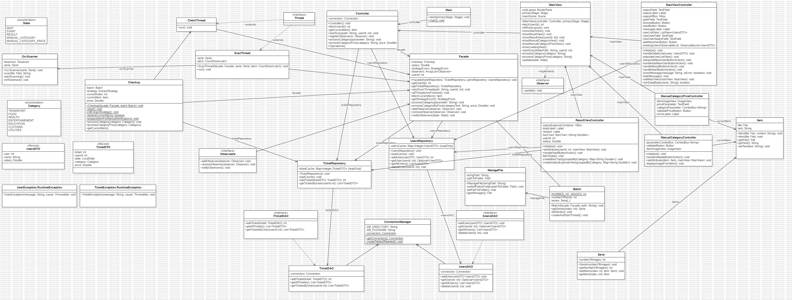

# Nom du Projet

      

## Auteurs

- Groupe D111
- g63024 KRIMOU Sohaïb
- g62098 NOJE Alessian 

## Description du Projet

Ce projet est une application Java permettant de gérer le budget. Son fonctionnement est plutôt simple :
- Il faut tout d'abord entrer le montant de son salaire.
- Ensuite, il suffit de scanner les factures. L'application se charge d'identifier la catégorie de dépense concernée (loisir, bien de consommation essentiel, transport, etc.).
- Un graphique est alors généré pour illustrer le cash flow des dépenses.

## Diagramme de Classe

Le diagramme de classe ci-dessous illustre la structure du modèle de l'application. 



## Choix de l'Architecture

L'architecture retenue pour ce projet est _model-view-controller_. 


## Plan de Tests Fonctionnels

Les tests fonctionnels élémentaires pour le projet sont les suivants :

- ...

## Calendrier Hebdomadaire des Tâches

### Semaine 1 - 6H

| Qui       | Description  
|--         | --
|Tous       | Analyse du projet.
|           | Créations du diagramme de classe
|           | Créations du README.md
|           | Initialisation de Git
|           | Configuration de l'environnement de développement

### Semaine 2 - 6H

| Qui       | Description  
|--         | --
|Tous       | Création des classes de la partie OCR
|           | Création des classes de la partie View
|           | Création des classes de la base de données

### Semaine 3 - 6H

| Qui       | Description  
|--         | --
|Alessian   | Création des méthodes de la partie base de données
|Alessian   | Ajout des données dans la base de données
|Sohaïb     | Traitement de l'image source et création de la vue en rapport à cette étape
|Tous       | Merge des 3 branches
|Tous       | Traduction du texte en TicketDTO (record)

### Semaine 4 - 6H

| Qui       | Description  
|--         | --
|Tous       | Debug du merge
|Sohaïb     | Création StartView
|Alessian   | Création ResultView

### Semaine 5 - 6H

| Qui       | Description  
|--         | --
|Tous       | Merge des vues
|Sohaïb     | Debug de la branches View/OCR/Thread
|Alessian   | Debug de la partie base de données

## Installation et utilisation

Pour utiliser l'application, suivez les étape suivantes : 

1. Clonez ce repository :
   ```bash
   git clone ...
   ```

2. Démarrez le projet en exécutant la commande 
   ```bash
   mvn javafx:run
   ```


## Problèmes connus de l'application

Lors de la réalisation des tests fonctionnels, nous avons constaté les problèmes suivants :

* Nous avons remarqué qu'il est difficile d'obtenir un ticket de caisse de qualité suffisante pour que le total de la commande puisse être extrait facilement.
* Nous avons dû abandonner l'idée d'une extraction automatique en raison du même problème que celui mentionné précédemment.

## Rétrospective

Nous avons constaté les différences suivantes entre le diagramme de classes imaginé au départ et l'implémentation réalisée :

* Nous avons remarqué qu'une nouvelle table était nécessaire.
* Nous avons dû changer notre structure en passant d'une matrice pour stocker les images à une structure composée de plusieurs classes.


